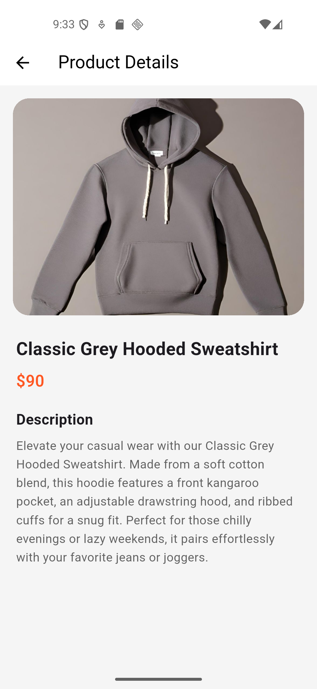
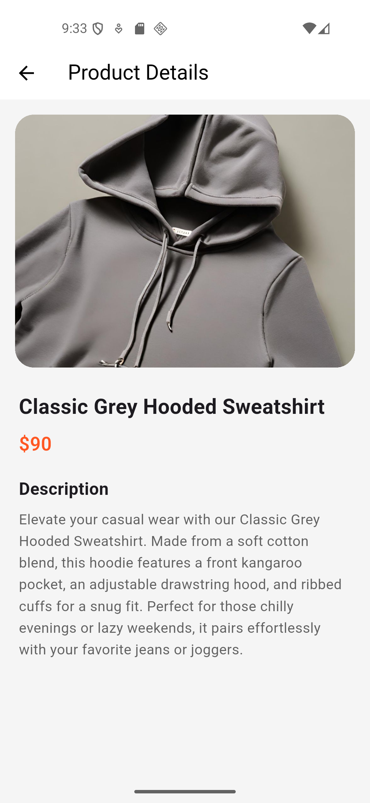

# Fake Store

A simple Flutter application that fetches and displays products using a fake store API.

## Screenshots

  
  
  

## Features

- View a list of products with their images, titles, and prices.
- Built using GetX for state management, dependency injection, and routing.
- Responsive grid layout for displaying products.

## Getting Started

To run this project, make sure you have [Flutter](https://docs.flutter.dev/get-started/install) installed.

1. Clone the repository.
2. Run `flutter pub get` to install dependencies.
3. Run `flutter run` to start the app on your connected device or emulator.
